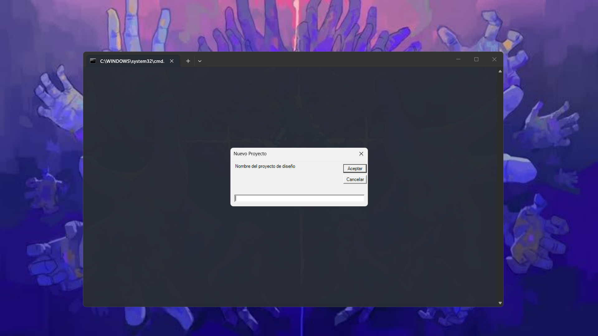
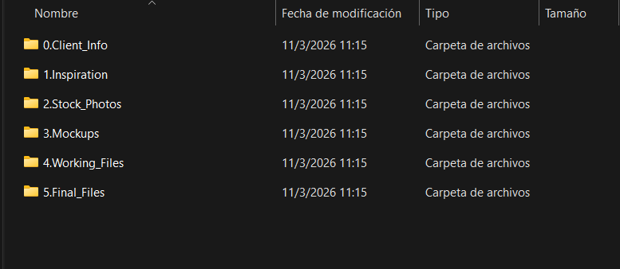
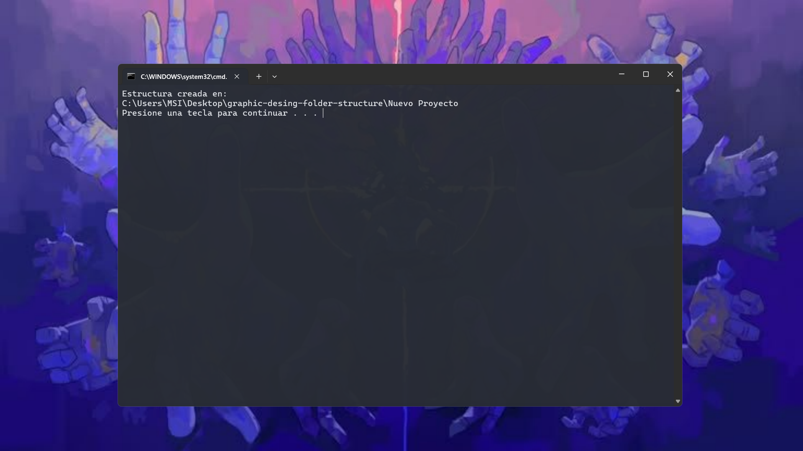

# graphic-desing-folder-structure



El script es bastante sencillo de usar, al dar docble click sobre el archivo `Nuevo_Proyecto_de_Diseño.bat`, este muestra por pantalla una ventana CMD vacía y una ventana de windows solicitando el nombre que deseamos darle al proyecto (y por tanto a la carpeta).
    
> *Nota: En caso de dejar dicho campo vacío, el proceso se cerrará y la estructura de carpetas no se creará.*

Una vez hallamos proporcionado el nombre del proyecto, se nos creará la siguiente estructura de carpetas.



...y podremos cerrar la ventana CMD residual.



La carpeta del proyecto se nos creará en la carpeta inmediatamente anterior a la ubicación del archivo `Nuevo_Proyecto_de_Diseño.bat`.

Es decir:
```
C:.
├───graphic-desing-folder-structure
│   ├───imgs
└───Nuevo Proyecto
    ├───0.Client_Info
    ├───1.Inspiration
    ├───2.Stock_Photos
    ├───3.Mockups
    ├───4.Working_Files
    └───5.Final_Files

```

- El nombre del archivo `Nuevo_Proyecto_de_Diseño.bat`, no es relevante para el funcionamiento, por lo que puede ser renombrado.
- El archivo `Nuevo_Proyecto_de_Diseño.bat`, es independiente por lo que puede ser movido o extraido de la carpeta `graphic-desing-folder-structure`. 

    > *Nota: tenga en cuenta que hacer esto podría afectar la ruta en que se crea su estructura de carpetas, por lo que se recomienda que el archivo `Nuevo_Proyecto_de_Diseño.bat` siempre se encuentre dentro de una carpeta.*
